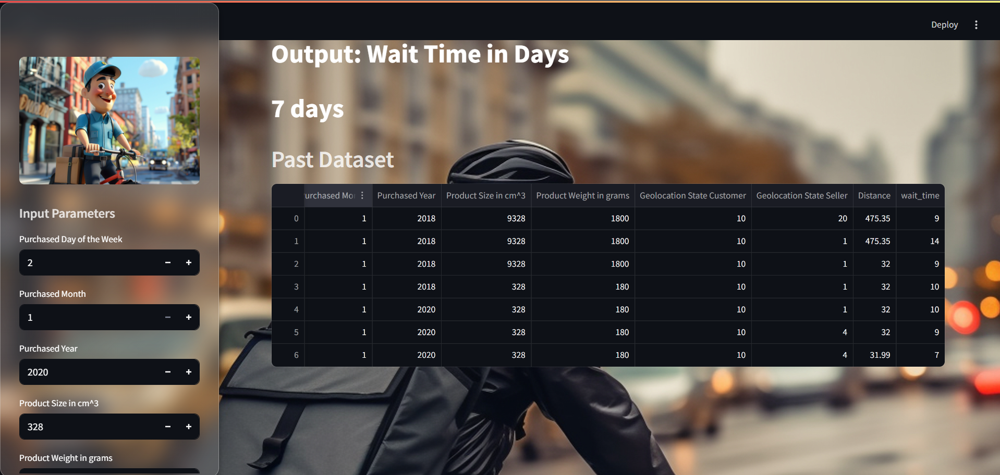

# 🚚 Delivery Prediction Project

This project is a machine learning-based system to **predict delivery outcomes** using voting classifiers. It includes a trained model (`voting_model.pkl`), a simple UI (`ui.py`), and some example input/output files for testing and documentation.

---

## 📁 Project Structure

```
DELIVERY_PROJECT/
├── Assigment6.docx            # Project documentation (Word)
├── Assigment6.pdf             # Project documentation (PDF)
├── image1.jpg / image2.jpg    # Supporting images
├── Screenshot.png             # UI or prediction output screenshot
├── ui.py                      # Python UI for prediction
├── voting_model.pkl           # Trained model file
└── .ipynb_checkpoints/        # Auto-saved notebook checkpoints
```

---

## 🚀 Getting Started

### 1. Install Dependencies

Create a virtual environment (optional):

```bash
python -m venv venv
source venv/bin/activate  # On Windows: venv\Scripts\activate
```

Install required packages:

```bash
pip install -r requirements.txt
```

> _Note: If `requirements.txt` is missing, you may need to install common packages like `pandas`, `scikit-learn`, `joblib`, etc._

---

### 2. Run the App

```bash
python ui.py
```

This will launch a basic interface or script that uses the trained `voting_model.pkl` to predict delivery success/failure.

---

## 🖼️ UI Preview

Below is a preview of the prediction interface or result screen:



---

## 📦 Files Description

- **`voting_model.pkl`**: Serialized trained model using VotingClassifier
- **`ui.py`**: Frontend or script for making predictions
- **`Assigment6.*`**: Documentation of model, problem statement, and methodology
- **`*.jpg / *.png`**: Visual documentation and example outputs

---

## 🧠 Model Info

- ✅ Ensemble Learning: Voting Classifier (e.g., Logistic Regression, Random Forest, etc.)
- 🧪 Trained on preprocessed delivery data
- 🧾 Features may include distance, delivery time, traffic, etc.

---
